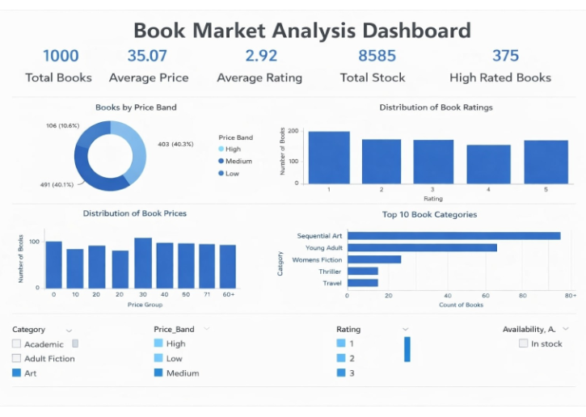
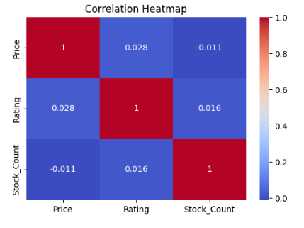
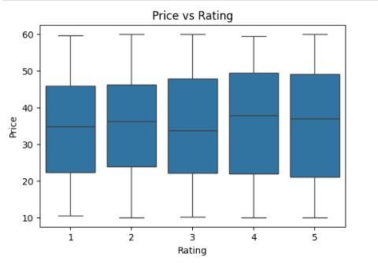
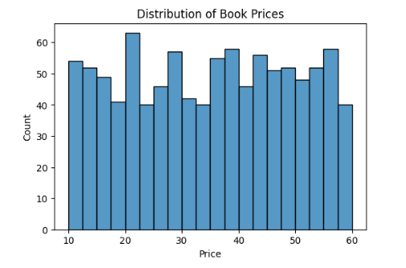

## 📚 Book Rating Prediction using Deep Learning

🚀 End-to-End Data Science + Deep Learning Project

## 📌 Overview

# This project performs complete data analysis on an online bookstore dataset and builds a deep learning model to predict book ratings based on various features such as price, category, and availability.

⸻

## 🎯 Objective
	•	Extract real-world data using web scraping
	•	Clean and preprocess raw data
	•	Perform exploratory data analysis (EDA)
	•	Build a machine learning and deep learning model
	•	Generate actionable insights

## 🛠️ Tools & Technologies
	•	Python
	•	BeautifulSoup (Web Scraping)
	•	Pandas, NumPy
	•	Matplotlib, Seaborn
	•	Scikit-learn
	•	TensorFlow / Keras
	•	Power BI

## 🔄 Project Workflow

# 1️⃣ Web Scraping
	•	Data collected from books.toscrape.com
	•	Extracted price, rating, category, availability

# 2️⃣ Data Cleaning & Preprocessing
	•	Removed inconsistencies and missing values
	•	Converted data types
	•	Prepared dataset for modeling

# 3️⃣ Exploratory Data Analysis (EDA)
	•	Analyzed price distribution
	•	Studied rating patterns
	•	Category-wise insights

# 4️⃣ Machine Learning
	•	Built baseline prediction models

# 5️⃣ Deep Learning Model
	•	Artificial Neural Network (ANN)
	•	Activation: ReLU, Sigmoid
	•	Optimizer: Adam

## 🧠 Model Performance
	•	Improved prediction accuracy using deep learning
	•	Compared ML vs DL results

## 📊 Dashboard

## 📌 Power BI dashboard included:
	•	Top 10 Book Category analysis
	•	Distribution of Book Rating trends
	•	Availability insights
  •	Books by PriceBand
     ** Price Band -->>(High, Medium , Low) 
     
## 📁 Repository Structure
	•	Books_web_scraping.ipynb → Data collection
	•	Data Cleaning and Preprocessing.ipynb → Cleaning
	•	Exploratory Data Analysis (EDA).ipynb → Analysis
	•	Machine Learning Model Development.ipynb → ML models
	•	POWERBI_DASHBOARD_DL.pdf → Dashboard
	•	README.md → Project documentation

## 📊 Visualizations

### 📌 Dashboard Overview

### 📊 Correlation Heatmap

### 📈 Price vs Rating Analysis

### 📉 Book Price Distribution

## 💡 Key Insights
	•	Certain categories consistently receive higher ratings
	•	Price is not always directly proportional to rating
	•	Deep learning provides better prediction performance

## 🚀 Future Improvements
	•	Deploy model using Streamlit
	•	Build recommendation system
	•	Apply NLP on book descriptions

## 🙌 Author

 "Shruti Sahu"
